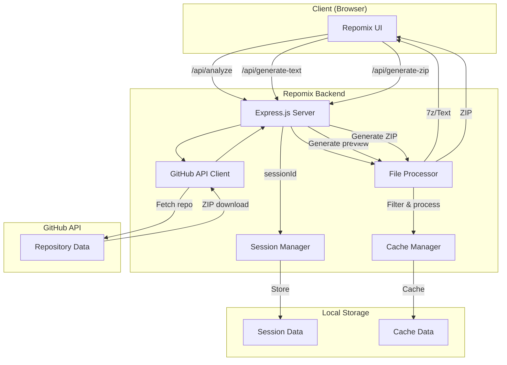
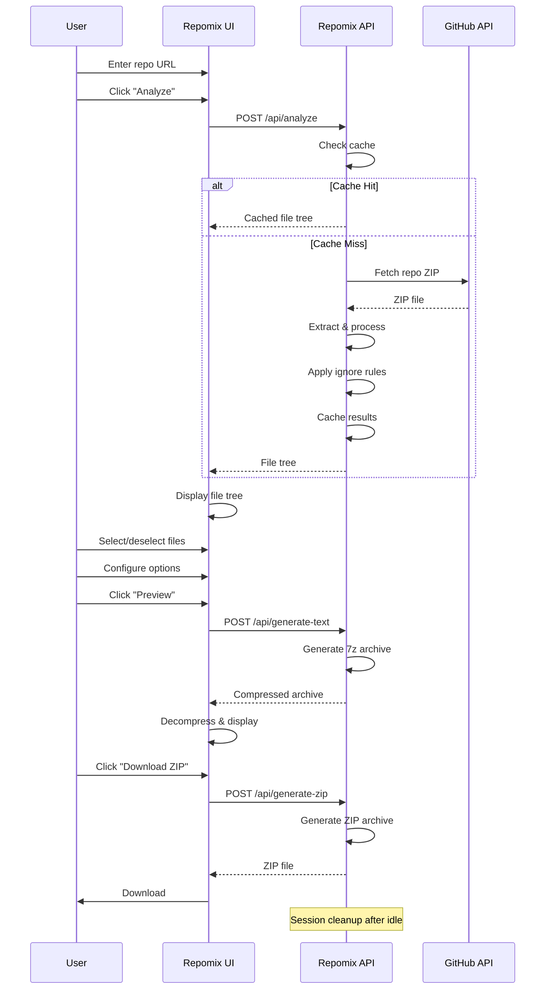

# repomix · Smart Repository Packer

[](https://github.com/kushalkumarj2006/repomix/blob/main/LICENSE)
[](https://kushalkumarj2006.github.io/repomix)
[](https://github.com/kushalkumarj2006/repomix/commits/main)
[](https://github.com/kushalkumarj2006/repomix)

> A modern, intuitive web interface for analyzing GitHub repositories, selecting files, and generating compressed exports with smart ignore rules.

---

## Overview

**Repomix** is a sleek, browser-based tool that helps developers analyze, filter, and export codebases with ease. It connects to a backend service that fetches repository contents, applies custom ignore rules, and generates compressed archives for efficient sharing and analysis.

Built for developers who need to share codebases with AI assistants, conduct code reviews, or create clean documentation exports.

---

## Features

| Feature | Description |
|---------|-------------|
| 🐙 **GitHub Integration** | Fetch any public GitHub repository with a single click |
| 📁 **Local Folder Support** | Load local folders directly in your browser |
| 🗜️ **ZIP Archive Support** | Upload and extract ZIP archives for analysis |
| 🚫 **Smart Ignore Rules** | Filter out unwanted files using pattern matching |
| 🌲 **Interactive File Tree** | Browse, select, and deselect files visually |
| 📄 **Text Preview** | Generate a clean text export with optional line numbers |
| 📦 **7z Compression** | Ultra-compressed exports using 7z (best for text files) |
| 💾 **ZIP Download** | Standard ZIP export with DEFLATE compression |
| ⚡ **Smart Caching** | Repository caching for instant re-analysis |
| 🔑 **Session Management** | Multi-session support with automatic cleanup |
| 🎨 **Clean UI** | Dark theme with responsive design |

---

## Technology Stack

| Layer | Technology |
|-------|------------|
| **Frontend** | Vanilla HTML, CSS, JavaScript |
| **Backend** | Node.js + Express |
| **Compression** | 7z (primary) + AdmZip (fallback) |
| **Deployment** | Render (backend) + GitHub Pages (frontend) |
| **Auth** | API secret-based authentication |

---

## Architecture



---

## Repository Structure

The project consists of **two main components** that work together:

| Component | Role | Technology | Deployed To |
|-----------|------|------------|-------------|
| **[Frontend](https://github.com/kushalkumarj2006/repomix)** | UI & client logic | HTML, CSS, JavaScript | GitHub Pages |
| **[Backend](https://github.com/kushalkumarj2006/repomix/tree/main/render)** | API server & processing | Node.js, Express | Render.com |

```
repomix/
├── index.html              # Main UI page
├── script.js               # UI logic + API client
├── style.css               # Dark theme styles
├── render/                 # Backend server
│   ├── server.js           # Express API server
│   ├── package.json        # Node.js dependencies
│   └── .env                # Configuration (not in repo)
├── LICENSE                 # MIT License
└── README.md               # Project documentation
```

### Why Two Components?

| Reason | Benefit |
|--------|---------|
| **Separation of Concerns** | Frontend and backend can be updated independently |
| **Different Deployment Targets** | Frontend → static hosting, Backend → server |
| **Scale Independently** | Each can be optimized for its own workload |
| **API Reusability** | Backend can serve multiple frontends |
| **Development Flexibility** | Different tech stacks (Node.js vs vanilla JS) |

---

## Workflow



---

## API Endpoints

| Method | Endpoint | Purpose |
|--------|----------|---------|
| `POST` | `/api/analyze` | Analyze GitHub repo, apply ignore rules |
| `POST` | `/api/generate-text` | Generate 7z compressed text preview |
| `POST` | `/api/generate-zip` | Generate ZIP archive of selected files |
| `GET` | `/test` | Test authentication and rate limits |
| `GET` | `/health` | Basic health check (public) |
| `GET` | `/health/full` | Detailed health metrics (public) |

---

## Installation & Setup

### 1. Clone the Repository

```bash
git clone https://github.com/kushalkumarj2006/repomix.git
cd repomix
```

### 2. Configure the Backend

```bash
cd render
npm install
```

Create a `.env` file:

```env
# Authentication
SECRET_KEY=your-secret-key-here

# GitHub Tokens (optional, for higher rate limits)
GITHUB_TOKENS=github_pat_xxx,github_pat_yyy

# Server
PORT=3000
```

### 3. (Optional) Install 7z for Better Compression

```bash
# Ubuntu/Debian
sudo apt-get install p7zip-full

# macOS
brew install p7zip

# Windows (download from 7-zip.org)
```

Without 7z, the server falls back to gzip compression.

### 4. Start the Backend

```bash
# From render directory
npm start
```

You should see:
```
🚀 Repomix Backend running on port 3000
🔐 Authentication: ENABLED
👥 Max concurrent sessions: 3
🗜️ Compression: 7z (best for text)
```

### 5. Open the Frontend

The frontend is a static HTML page. Open it by:

**Option A: Direct**
```bash
# From repomix directory
open index.html  # Mac
start index.html # Windows
xdg-open index.html # Linux
```

**Option B: Serve with a local server**
```bash
npx serve .
# or
python3 -m http.server 8000
```
Then open `http://localhost:8000`.

**Option C: Deploy to GitHub Pages**
1. Push the repository to GitHub
2. Enable GitHub Pages in repository settings
3. Access at `https://your-username.github.io/repomix`

### 6. Connect Frontend to Backend

In the browser console (F12), set your API key:

```javascript
key("your-secret-key-here")
```

If running locally, update `BACKEND_URL` in `script.js`:
```javascript
const BACKEND_URL = 'http://localhost:3000';
```

### 7. Start Using Repomix

1. Enter a GitHub repository (e.g., `kushalkumarj2006/repomix`)
2. Click **"🔍 Analyze Repository"**
3. Browse the file tree and select/deselect files
4. Configure output options (line numbers, comments, etc.)
5. Click **"📄 Generate & Preview"** or **"📦 Download ZIP"**

---

## Ignore Patterns

Repomix supports powerful ignore patterns similar to `.gitignore`:

### Supported Pattern Types

| Pattern | Description | Example |
|---------|-------------|---------|
| **File names** | Exact file name match | `package-lock.json` |
| **Folder names** | Exact folder name match | `node_modules/` |
| **Wildcards** | Pattern matching with `*` | `*.min.js` |
| **Nested folders** | Matches anywhere in path | `.git/` |

### Default Patterns

```ignore
node_modules/
.git/
.DS_Store
dist/
build/
coverage/
*.min.js
__pycache__/
.env
.vscode/
.idea/
package-lock.json
yarn.lock
*.log
*.tmp
*.zip
*.tar
*.gz
*.jpg
*.jpeg
*.png
*.gif
*.ico
*.svg
*.mp4
*.webm
*.mp3
*.wav
*.pdf
*.doc
*.docx
*.exe
*.dll
*.so
*.bin
*.db
```

### Custom Patterns

Users can modify the ignore patterns in the textarea. Patterns are applied during analysis and file loading.

```ignore
# Ignore test files
*.test.js
__tests__/

# Ignore documentation
docs/
*.md

# Ignore specific file
config/secrets.json
```

---

## Output Options

| Option | Description |
|--------|-------------|
| **📁 Include Directory Structure** | Add a visual file tree to the output |
| **🔢 Show Line Numbers** | Add line numbers to code preview |
| **💬 Remove Comments** | Strip comments from code files |
| **📏 Remove Empty Lines** | Clean up output by removing blank lines |

### Comment Removal Support

| Language | Extensions |
|----------|------------|
| JavaScript/TypeScript | `.js`, `.jsx`, `.ts`, `.tsx`, `.mjs`, `.cjs` |
| Python | `.py` |
| HTML/XML | `.html`, `.xml`, `.svg` |
| CSS/SCSS/SASS | `.css`, `.scss`, `.sass`, `.less` |
| JSON | `.json` |
| C/C++ | `.c`, `.cpp`, `.h`, `.hpp`, `.cc`, `.cxx` |
| Java | `.java` |
| Go | `.go` |
| Rust | `.rs` |
| Ruby | `.rb` |
| PHP | `.php` |
| SQL | `.sql` |
| C# | `.cs` |
| Swift | `.swift` |
| Kotlin | `.kt`, `.kts` |
| Shell | `.sh`, `.bash`, `.zsh`, `.fish` |
| Lua | `.lua` |
| Perl | `.pl`, `.pm` |

---

## Caching & Sessions

### Repository Cache

Repomix caches up to **5 repositories** at a time:

| Metric | Description |
|--------|-------------|
| **Cache Size** | 5 repositories (LRU eviction) |
| **Cache Key** | `owner/repo/branch` |
| **Access Tracking** | Last accessed time & access count |
| **Eviction Policy** | Least recently used (LRU) |

### Session Management

Sessions track user activity and manage temporary files:

| Metric | Description |
|--------|-------------|
| **Max Sessions** | 3 concurrent sessions |
| **Session Timeout** | 1 hour (inactive) |
| **Eviction Policy** | Least recently used (LRU) |
| **Cleanup** | Automatic background cleanup |

### Session Storage

Each session gets its own temporary directory:

```
temp/
├── {sessionId}/
│   ├── output.7z        # Generated archive
│   ├── output.zip       # ZIP archive
│   └── content.txt      # Text content
└── temp_legacy/         # Legacy storage
```

---

## Compression

### Primary: 7z (Ultra Mode)

| Setting | Value |
|---------|-------|
| **Format** | 7z |
| **Compression Level** | 9 (Ultra) |
| **Method** | LZMA2 |
| **Dictionary Size** | 64 MB |
| **Fast Bytes** | 273 |
| **Solid Mode** | Enabled |

**Why 7z is best for text:**
- Superior compression ratio (up to 70% smaller than ZIP)
- Optimized for text files
- Multi-threaded by default

### Fallback: gzip

If 7z is not installed, the server falls back to gzip compression with maximum compression level.

---

## Environment Variables

| Variable | Description | Default | Required |
|----------|-------------|---------|----------|
| `SECRET_KEY` | API authentication key | - | ✅ Yes |
| `GITHUB_TOKENS` | GitHub API tokens (comma-separated) | - | No |
| `PORT` | Server port | 3000 | No |

### GitHub Tokens

Tokens are used to increase API rate limits:

| Tier | Rate Limit |
|------|------------|
| **Unauthenticated** | 60 requests/hour |
| **Authenticated** | 5,000 requests/hour |
| **Multiple Tokens** | Round-robin load balancing |

Format for multiple tokens:
```
GITHUB_TOKENS=github_pat_xxx,github_pat_yyy,github_pat_zzz
```

---

## Security

- **API Secret**: All requests require a secret key (set via `key()` in console)
- **CORS**: Restricts origins to known frontend domains
- **Session Isolation**: Each session has its own temporary directory
- **Cleanup**: Sessions are automatically terminated on idle timeout
- **File Filtering**: Binary files are automatically filtered out

---

## Common Setup Issues & Solutions

| Issue | Solution |
|-------|----------|
| **"No API key" error** | Run `key("your-secret")` in browser console |
| **Backend not starting** | Check `SECRET_KEY` is set in `.env` |
| **CORS errors** | Update `allowedOrigins` in `server.js` |
| **Rate limit exceeded** | Add GitHub tokens via `GITHUB_TOKENS` env var |
| **7z not found** | Install 7z or let it fall back to gzip |
| **Repo not found** | Ensure the repo is public and name is correct |
| **Binary files included** | Binary files are auto-filtered, use ignore patterns for others |

---

## Testing

### Test Authentication & Rate Limits

```javascript
// In browser console (after setting key)
test()
```

### View Active Sessions

```javascript
// In browser console
sessions()
```

### Health Check

```bash
# Basic health
curl http://localhost:3000/health

# Full health (detailed metrics)
curl http://localhost:3000/health/full
```

---

## Future Improvements

- [ ] Support for private repositories (SSH/HTTPS auth)
- [ ] File search within repository
- [ ] Multiple compression formats (ZIP, 7z, TAR, GZ)
- [ ] Export as JSON (for AI training)
- [ ] Upload to cloud storage (S3, GCS)
- [ ] Batch repository analysis
- [ ] Diff between two repositories
- [ ] File size breakdown charts
- [ ] Language detection and statistics
- [ ] Code syntax highlighting in preview

---

## Contributing

Contributions are welcome! Please feel free to submit a Pull Request.

1. Fork the repository
2. Create your feature branch (`git checkout -b feature/AmazingFeature`)
3. Commit your changes (`git commit -m 'Add some AmazingFeature'`)
4. Push to the branch (`git push origin feature/AmazingFeature`)
5. Open a Pull Request

---

## License

MIT License — see [LICENSE](LICENSE) for details.

---

## Acknowledgments

- [JSZip](https://stuk.github.io/jszip/) - ZIP generation in browser
- [pako](https://github.com/nodeca/pako) - Decompression library
- [AdmZip](https://github.com/cthackers/adm-zip) - ZIP processing in Node.js
- [archiver](https://github.com/archiverjs/node-archiver) - Streaming ZIP generation
- [7z](https://www.7-zip.org/) - Ultra compression
- [Render](https://render.com/) - Backend hosting
- [GitHub API](https://docs.github.com/en/rest) - Repository access

---

## Author

**Kushal Kumar J**

- GitHub: [@kushalkumarj2006](https://github.com/kushalkumarj2006)
- Project: [Repomix](https://github.com/kushalkumarj2006/repomix)

---

<div align="center">

**Repomix · Smart Repository Packer**

[](https://github.com/kushalkumarj2006/repomix)
[](https://repomix-v2.onrender.com)

</div>
